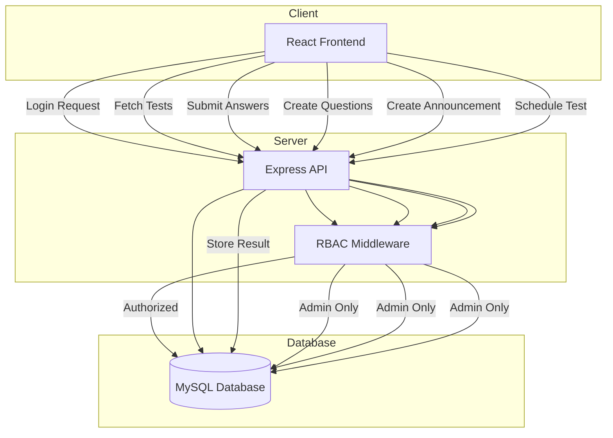

# 🧠 Logic Master — Train Smarter. Think Faster. Master Logical Reasoning.

<div align="center">

**A full-stack web platform for conducting logical reasoning exams with role-based access control, performance tracking, and admin management tools.**

🌐 Live (https://dbm-sproject-rose.vercel.app)

</div>

---

# 🌟 Overview

**Logic Master** is a modern full-stack examination platform designed to conduct structured logical reasoning tests in a controlled online environment.

The system supports two primary roles:

* **Users** → attempt tests, track results, improve performance
* **Admins** → create questions, manage tests, schedule exams, post announcements

The project demonstrates production-level architecture including:

* RBAC authorization flow
* Modular backend design
* Cloud database integration
* Secure authentication
* Scalable frontend structure

---

# ✨ Core Features

### 👤 User Features

* Secure authentication
* Attempt logical reasoning tests
* Instant scoring & result storage
* Performance history tracking
* Clean exam interface

### 🛠️ Admin Features

* Role-protected admin dashboard
* Create / update / delete questions
* Schedule exams
* Post announcements
* Manage user attempts

### 🔐 Security & Architecture

* RBAC middleware authorization
* Token-based authentication
* Protected API routes
* Structured backend layering

---

# 🧠 System Architecture & Flow

The application follows a **3-layer architecture** with RBAC integrated into backend request handling.



---

# 🔄 Functional Flow

### 👤 User Journey

1. User logs in
2. Backend validates role via RBAC middleware
3. User views available tests
4. Attempts logical reasoning questions
5. Backend stores answers & returns results
6. User can view performance history

---

### 🛠️ Admin Journey

1. Admin logs in and accesses dashboard
2. Backend verifies admin privileges
3. Admin can:

   * Manage questions
   * Schedule exams
   * Post announcements
4. All changes persist in database
5. Frontend reflects updates via API responses

---

# 🛠️ Tech Stack

### **Frontend**

* React.js
* Tailwind / CSS
* Axios API handling

### **Backend**

* Node.js
* Express.js REST API
* JWT Authentication
* RBAC Middleware Layer

### **Database**

* MySQL (Aiven Cloud)

---

# 🖼️ Application Screenshots


## 📝 Test Interface


---

# 📂 Project Structure (MCP Architecture)

This project follows the **MCP (Modular Component Pattern)**.

Instead of mixing business logic everywhere, MCP separates responsibilities into clear layers:

### ✔ Why MCP matters

* Improves scalability for large projects
* Keeps backend maintainable
* Encourages clean code separation
* Makes team collaboration easier
* Allows adding new modules without breaking old ones

---

### 📁 Important Structure Only

```
DBMSproject/

frontend/
├── src/
│   ├── pages/            # Route-level UI views
│   ├── components/       # Reusable UI elements
│   ├── services/         # API request handlers
│   ├── context/          # Authentication/global state
│   └── App.jsx

backend/
├── controllers/          # Request logic
├── routes/               # API endpoints
├── middleware/           # RBAC & auth checks
├── models/               # DB queries / schemas
├── config/               # DB + env configuration
└── server.js             # Application entry point
```

---

# 🔧 Local Development

### Start Backend

```bash
cd backend
npm install
npm run dev
```

Runs on:
**[http://localhost:5000](http://localhost:5000)**

---

### Start Frontend

```bash
cd frontend
npm install
npm run dev
```

Runs on:
**[http://localhost:5173](http://localhost:5173)**

---

# 📌 What Makes This Project Strong

* Demonstrates full-stack architecture understanding
* Shows RBAC implementation (important for real products)
* Uses structured backend layering
* Includes admin dashboard logic
* Real database integration (not mock data)
* Built with scalability in mind
* Clear separation between UI, API, and data
